# MsSqlUnitTest
## 1. DB First 建立測試用的庫跟表<br>
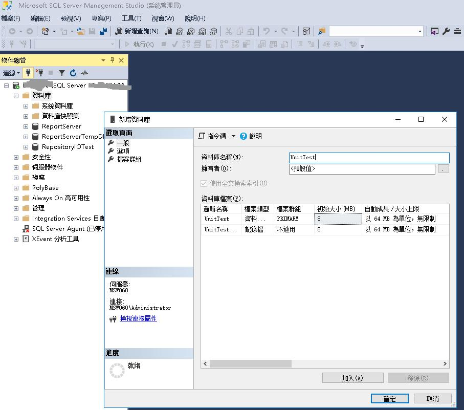
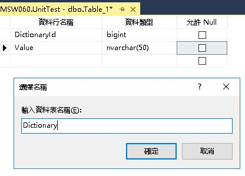

## 2. 建立VisualStudio專案<br>
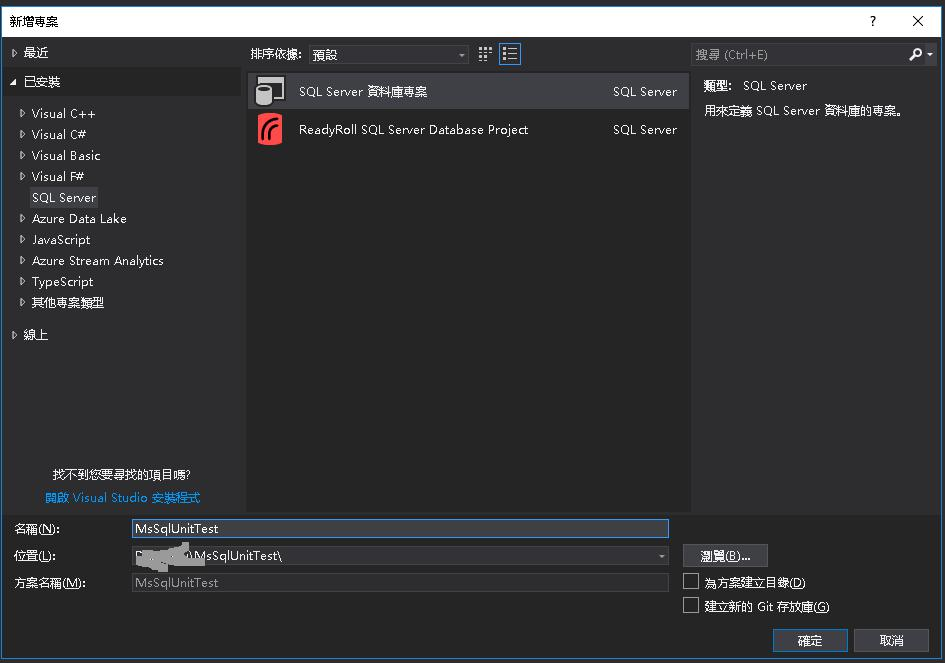

## 3. 匯入建立好的庫<br>
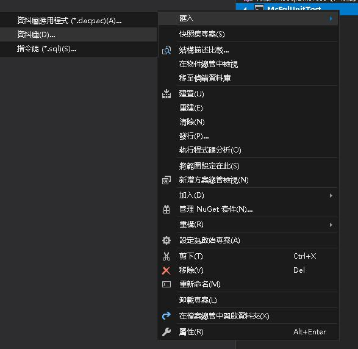
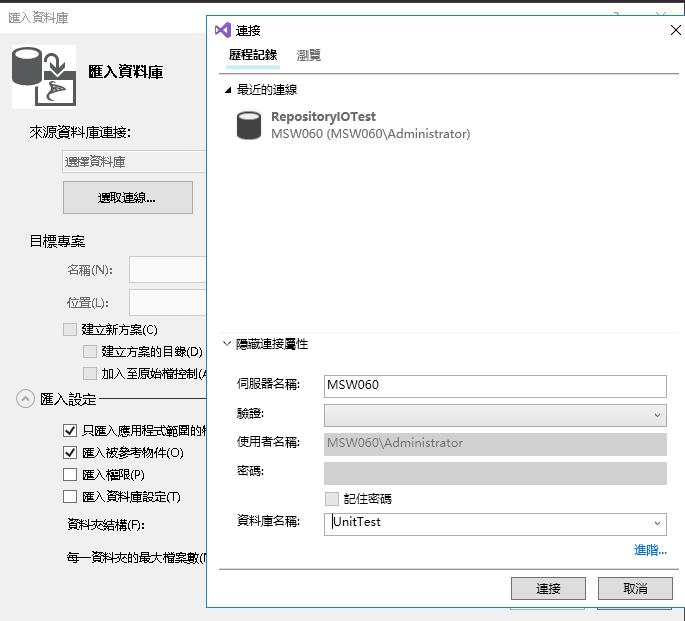
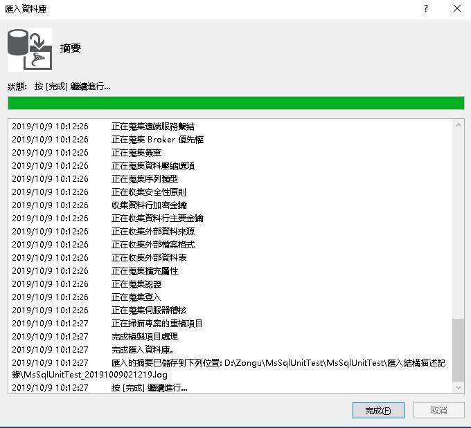

## 4. 新建SP<br>
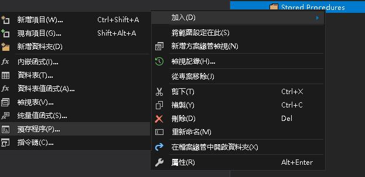
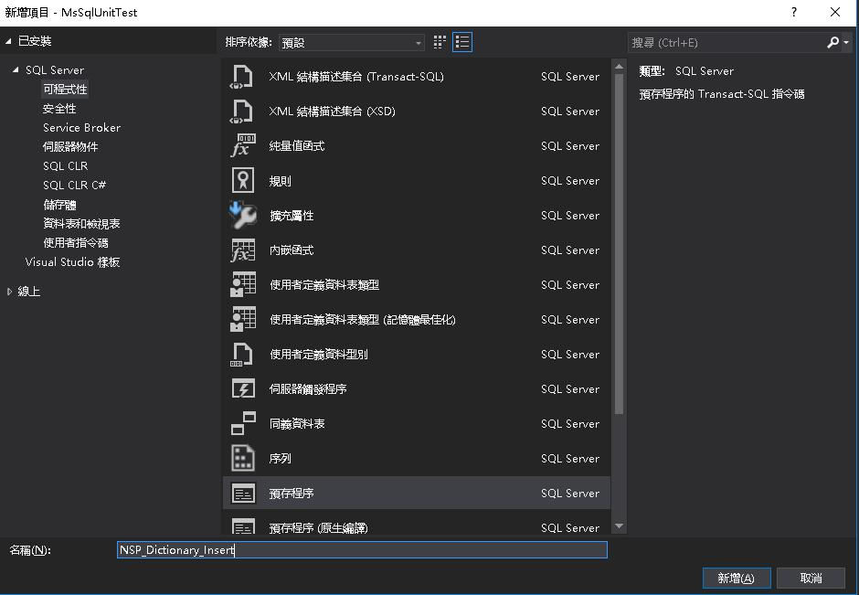
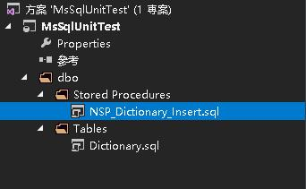

```
/*
	新建Dictionary資料
	2019-10-17	Carter	Create


	ex:
		exec NSP_Dictionary_Insert
		@DictionaryId = 1,
		@Value = 'Test123'
*/

CREATE PROCEDURE [dbo].[NSP_Dictionary_Insert]
	@DictionaryId BIGINT,
	@Value	NVARCHAR(50)
AS
	INSERT INTO Dictionary 
	OUTPUT inserted.*
	VALUES (@DictionaryId, @Value)
RETURN 0
GO
GRANT EXECUTE
    ON OBJECT::[dbo].[NSP_Dictionary_Insert] TO PUBLIC
    AS [dbo];
```

## 5. 發行資料庫專案<br>
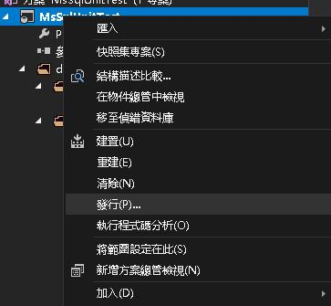
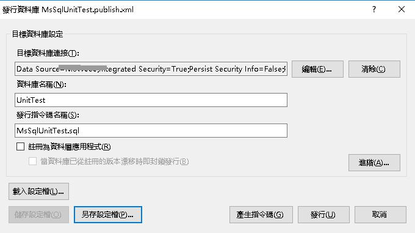

## 6. 利用LinqPad取得強型別<br>
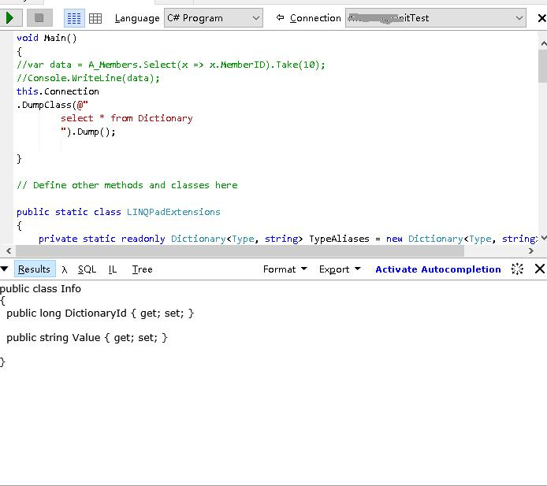

## 7. 建立類別<br>
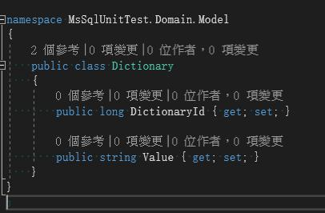

## 8. 建立介面並定義行為<br>
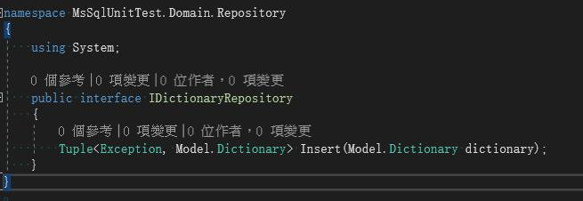

## 8. 建立實作<br>
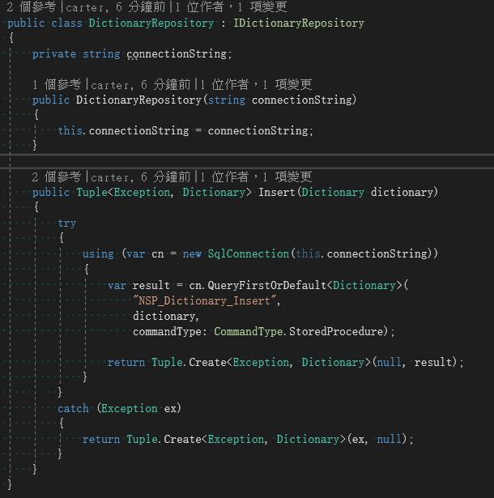

## 9. 新增單元測試專案<br>
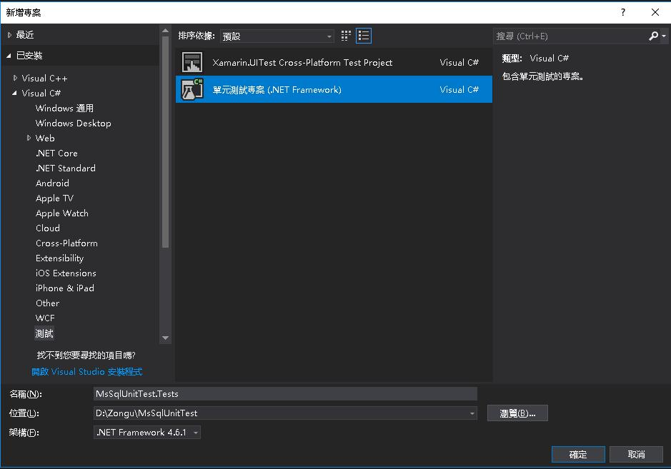
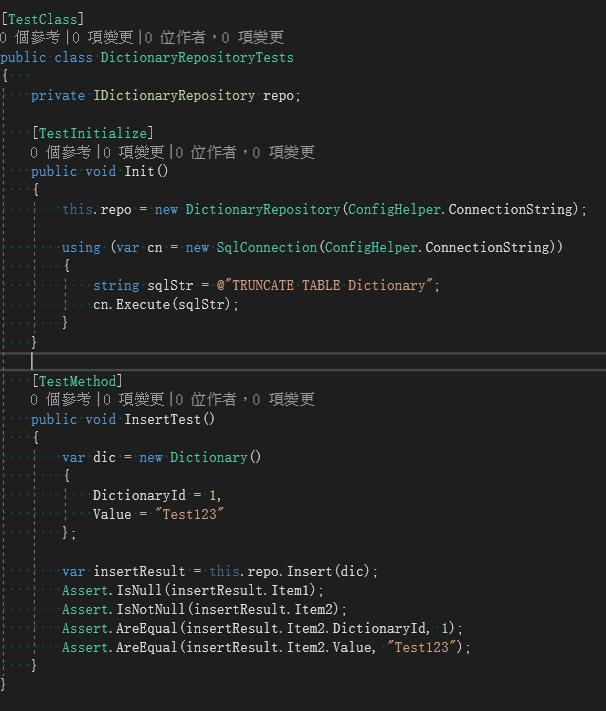

---
<br>
<br>
<br>
<br>

# 進階版本(DB佈署工具)
## 1. 建立Migration專案<br>
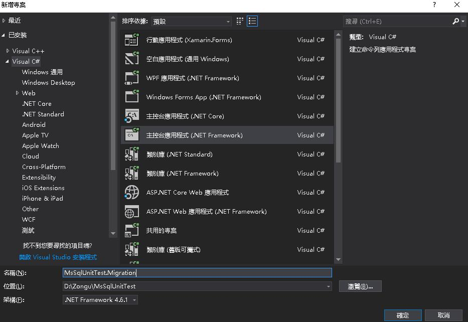

## 2. Nuget加入dbup(強烈建議用3.3.2版本，不然會有編碼問題),dbup-consolescripts參考<br>
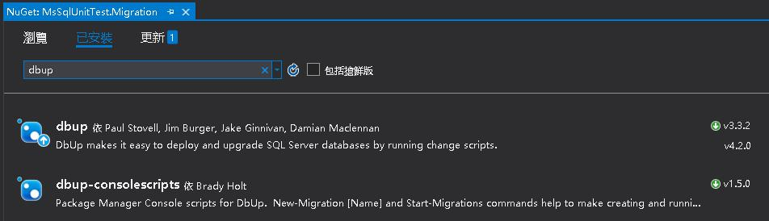

## 3. 透過套件管理工具建立Migration腳本<br>
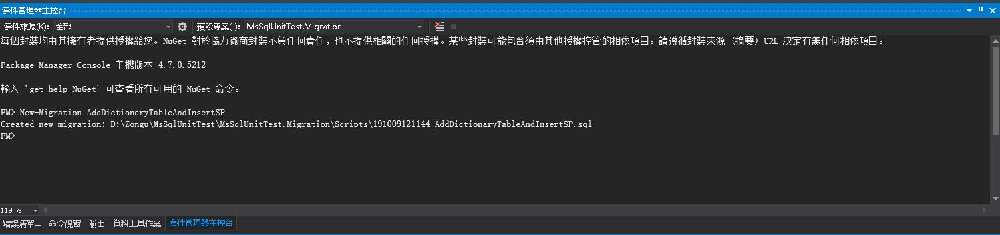

## 4. 撰寫Migration腳本<br>
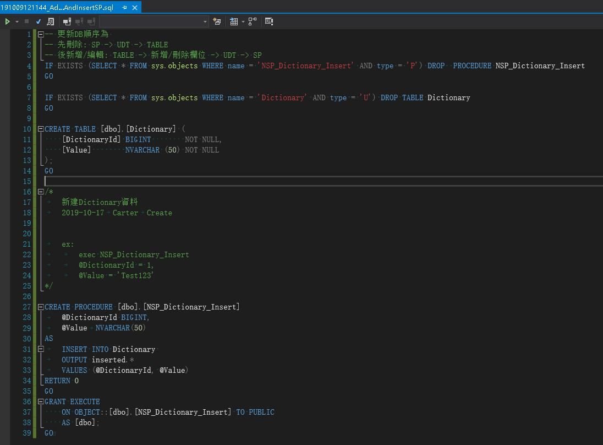

## 5. 執行結果<br>
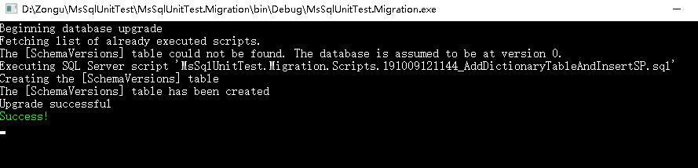

## 5. 庫裡會多一張SchemaVersions表紀錄每個Migration更新時間<br>
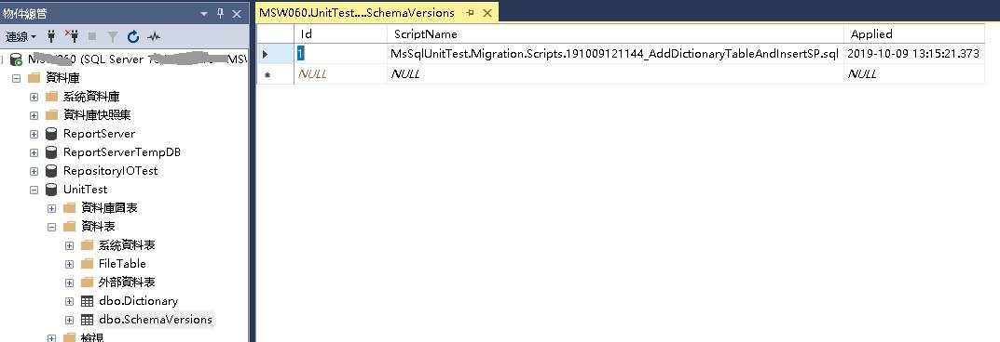